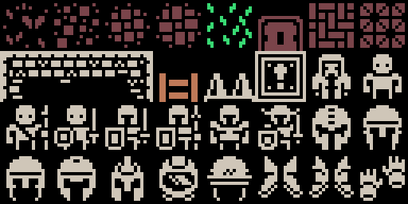
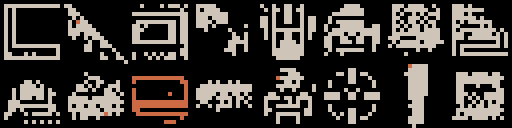
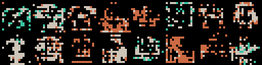
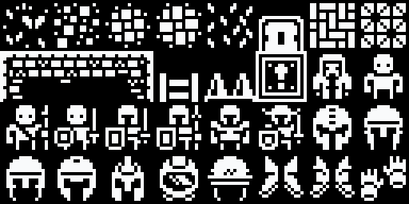
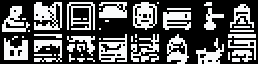
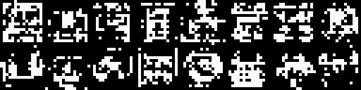
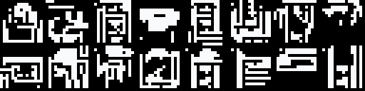

# Pixel Art Generative Model

A learning-oriented project comparing three generative architectures for producing 16x16 pixel art sprites. Built with PyTorch, tracked with MLflow.

## Results

### Colored sprites (8-color palette, 1000 epochs)

**Training data** (Kenney 1-Bit Pack colored variant, CC0):



**Diffusion (DDIM, 50-step sampling)**:



Coherent colored sprites with correct palette use — buildings, monitors, characters. DDIM sampling produces these in under 1 second.

**VAE**:



Color placement is reasonable but shapes are blurry. Multi-color makes the VAE averaging problem more visible.

### Monochrome sprites (2-color, 500 epochs)

**Training data**:



| Diffusion | VAE (BCE loss) | VQ-VAE (with prior) |
|-----------|---------------|---------------------|
|  |  |  |

Diffusion produces the sharpest output. VAE with BCE loss gives better edges than MSE. VQ-VAE with a learned autoregressive prior generates coherent sprites (random indices produce checkerboard noise).

## Architecture

The project uses the **strategy pattern** to swap generative architectures while sharing all infrastructure:

```
Trainer (context)
  ├── training loop, optimizer, device management
  ├── MLflow logging
  └── palette snapping + sample grids

GenerativeStrategy (ABC)
  ├── build_model(config) → nn.Module
  ├── train_step(model, optimizer, batch) → loss_dict
  ├── sample(model, n_samples, device) → images
  └── get_metrics(model, batch) → metrics

Concrete strategies:
  ├── VAEStrategy      (~138K params, continuous latent, reparameterization trick)
  ├── VQVAEStrategy    (~140K params, discrete codebook, straight-through estimator)
  └── DiffusionStrategy (7.4M params, U-Net, 1000-step linear noise schedule)
```

Adding a new strategy means implementing the ABC and adding one line to the registry. The Trainer, data pipeline, and logging remain untouched.

## Tutorial Docs

This project is a learning tool. Each major concept has a tutorial-style explanation in [`docs/learn/`](docs/learn/):

- [00 — Strategy Pattern](docs/learn/00-strategy-pattern.md): Why this architecture, how Trainer/Strategy interact
- [01 — Data Pipeline](docs/learn/01-data-pipeline.md): Pixel art constraints, palette extraction, augmentation
- [02 — VAE](docs/learn/02-vae.md): Reparameterization trick, ELBO, KL weighting, blurry output
- [03 — VQ-VAE](docs/learn/03-vqvae.md): Vector quantization, straight-through estimator, codebook collapse
- [04 — Diffusion](docs/learn/04-diffusion.md): Noise scheduling, epsilon prediction, denoising loop

## Quick Start

```bash
# Install dependencies
uv sync

# Download dataset (Kenney 1-Bit Pack, CC0)
uv run python scripts/download_data.py

# Run smoke test (validates all strategy contracts)
uv run python scripts/smoke_test.py

# Train a specific strategy
uv run python scripts/train.py --config configs/diffusion.yaml

# Train all three and generate comparison grids
uv run python scripts/train_comparison.py

# View experiment tracking
mlflow ui
```

## Project Structure

```
├── configs/                    # OmegaConf YAML configs (base + per-strategy)
├── docs/learn/                 # Tutorial docs (the project's primary learning artifact)
├── src/
│   ├── strategies/
│   │   ├── base.py             # GenerativeStrategy ABC
│   │   ├── vae.py              # VAE strategy
│   │   ├── vqvae.py            # VQ-VAE strategy
│   │   └── diffusion.py        # DDPM diffusion strategy
│   ├── models/
│   │   ├── encoder.py          # ConvEncoder, ConvDecoder, VAEModel
│   │   ├── codebook.py         # VectorQuantizer
│   │   ├── unet.py             # U-Net with time conditioning
│   │   └── blocks.py           # ResBlock, Downsample, Upsample, SinusoidalTimeEmbedding
│   ├── trainer.py              # Training loop (strategy-agnostic)
│   ├── palette.py              # K-means palette extraction + snapping
│   └── mlflow_logger.py        # MLflow wrapper
├── scripts/
│   ├── train.py                # Single strategy training
│   ├── train_comparison.py     # All-strategy comparison run
│   ├── smoke_test.py           # Strategy contract validation
│   └── download_data.py        # Dataset download + tilesheet slicing
└── .agents/dev_docs/           # Task plans, context, and design decisions
```

## Dataset

[Kenney 1-Bit Pack](https://kenney.nl/assets/1-bit-pack) — 1,077 monochrome 16x16 sprites (CC0 license). The comparison training uses a focused subset of 873 sprites filtered for medium pixel density (characters, items, UI elements).

## Requirements

- Python 3.11+
- PyTorch (MPS backend for Apple Silicon, CUDA, or CPU)
- [uv](https://docs.astral.sh/uv/) for dependency management
